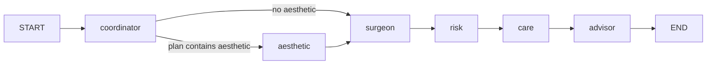
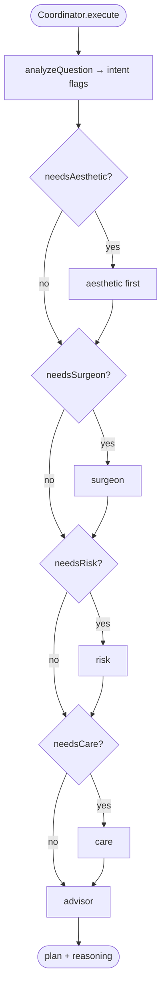
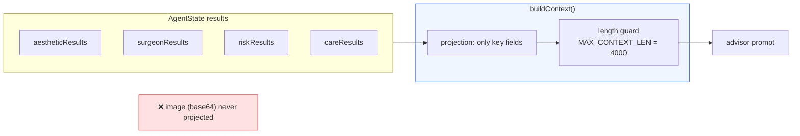
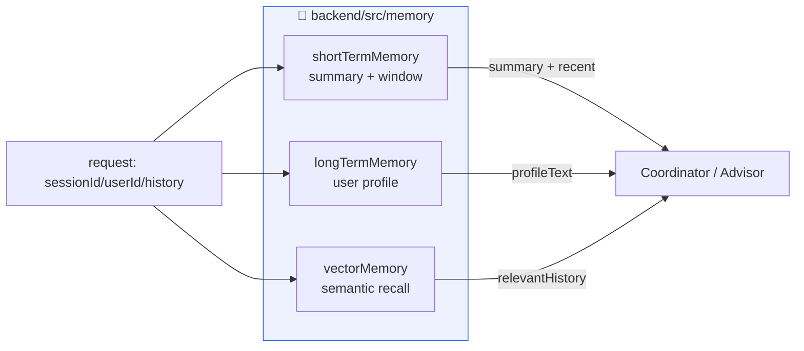

# Multi-Agent Plastic Surgery Consultation System — Design Document

> Date: 2026-08-11 · Status: Implemented

## 1. Overview

A multi-agent AI consultation system for plastic surgery and aesthetic medicine. The system re-targets the domain from general medicine/medication to **plastic surgery and aesthetics**, and adds a **photo (vision) analysis** path using Google Gemini's multimodal capabilities.

## 2. Goals

1. Preserve the proven LangGraph orchestration + SSE streaming architecture.
2. Replace the medical domain with a plastic surgery / aesthetic domain across all agents.
3. Support photo-based consultations (upload a face/body photo + text → visual aesthetic analysis).
4. Keep the optional pgvector RAG (plastic surgery knowledge base) with safe degradation when no database is configured.
5. Full-stack TypeScript, Vitest unit tests, English documentation.

## 3. Agent Design

Six agents form the graph:

| Node | Class | Responsibility |
|---|---|---|
| `coordinator` | `CoordinatorAgent` | Intent analysis, builds ordered `plan` array |
| `aesthetic` | `AestheticAgent` | Facial/body aesthetic analysis; **photo vision** if image present, text-only otherwise |
| `surgeon` | `SurgeonAgent` | Procedure recommendation backed by pgvector RAG (degrades without DB) |
| `risk` | `RiskAssessorAgent` | Pre-operative risk level, contraindications, recommendations |
| `care` | `CareAgent` | Post-operative care plan, recovery timeline, warning signs |
| `advisor` | `AdvisorAgent` | Final synthesis via context projection + length guard |

## 4. State Graph



The coordinator's `plan` (e.g. `['aesthetic','surgeon','risk','care','advisor']`) drives conditional routing. Nodes execute in plan order; `advisor` is terminal.

### 4.1 Photo routing

- If `state.image` (data URI) is present **and** `needsAesthetic`, `aesthetic` is placed first.
- Without a photo but with aesthetic intent, `aesthetic` still runs in **text-only mode** (`analyzed: false`), a deliberate degradation path.
- The advisor projection **never** includes the base64 image.

### 4.2 Plan building

The coordinator's `buildPlan` decides node order from intent flags:



## 5. Shared State Types

See `backend/src/agents/types.ts`. Key additions:

- `AgentState.image?: string` — photo data URI.
- `AestheticResult` — `analyzed`, `photoObservations`, `facialAnalysis`, `concerns`, `suggestions`, `confidence`.
- `SurgeonResult` / `Procedure` — procedure name, type, indication, recovery time, risks, suitability.
- `RiskAssessmentResult` — `riskLevel`, `riskFactors`, `contraindications`, `recommendations`.
- `CareResult` — `recoveryTimeline`, `careTips`, `warningSigns`, `followUp`.
- `AdvisorResult` — `aestheticAnalysis`, `recommendedProcedures`, `riskAssessment`, `carePlan`, `precautions`, `references`, `urgency`, `disclaimer`.

## 6. Vision Path

`BaseAgent.invokeVision(prompt, imageDataUri)` builds a `HumanMessage` with mixed content parts:

```typescript
content: [
  { type: 'text', text: prompt },
  { type: 'image_url', image_url: { url: imageDataUri } },
]
```

It invokes the **shared model singleton** (`this.model.invoke`), so existing test mocking (`vi.spyOn(sharedModel, 'invoke')`) works unchanged.

## 7. Context Management (Advisor)

- **Projection**: only key fields are projected into the advisor prompt — no raw agent outputs, no base64 image.
- **Length guard**: `MAX_CONTEXT_LEN = 4000`. Oversized contexts are truncated with a logged warning; core info (aesthetic/procedure/risk/care) takes priority.
- Context length is logged per request to calibrate the threshold with real data.



## 8. RAG (Surgeon)

- `vectorStore.ts` exposes `getVectorStore()` (pgvector, collection `plastic_guides`) and `searchPlasticGuides(query, k)`.
- Seed data lives in `backend/data/plastic-guides/*.txt`, formatted `# procedure name` + `## section`.
- `scripts/ingest.ts` parses and embeds these chunks.
- Without `DATABASE_URL`, `searchPlasticGuides` throws and `SurgeonAgent` degrades to general LLM guidance with a warning.

## 9. API

- `POST /api/chat/stream` — body `{ message, image?, sessionId?, userId?, history? }`, SSE events `agent_start` / `agent_complete` / `final_result` / `error` / `done`.
- Route validates `image` against `^data:image/(png|jpeg|webp);base64,`.
- `express.json({ limit: '20mb' })` to accommodate photo payloads.
- `sessionId` / `userId` / `history` enable the memory system (all optional).

## 9.1 Memory System

The system implements a full memory stack, mirroring LangGraph's official
Checkpointer (short-term) + Store (long-term/vector) split, all **in-memory**
so it runs without any database:

| Memory | Module | Purpose |
|---|---|---|
| Short-term | `memory/shortTermMemory.ts` | Thread-scoped rolling window + LLM summarization of earlier turns |
| Long-term | `memory/longTermMemory.ts` | Cross-thread user profile (concerns / past procedures / preferences), file-persisted |
| Vector | `memory/vectorMemory.ts` | Past QA pairs embedded → cosine similarity recall |



**Design rules:**
- Client `history` is the **single source of truth** for short-term context; the server only accumulates a summary (incremental, via `messagesSeen`).
- Memory failures degrade silently and never interrupt the SSE stream.
- The advisor **memory block is trimmed first** on overflow (low priority); core per-turn results (aesthetic/procedure/risk/care) are never cut.
- Interfaces mirror LangGraph `Checkpointer`/`Store`; production can swap to `PostgresSaver`/`PostgresStore` without changing agents.

## 10. Testing Strategy

Vitest mocks the shared model and vector store so tests run offline:

- `BaseAgent.test.ts` — JSON extraction + `invokeVision` content-part assembly (image_url data URI).
- `CoordinatorAgent.test.ts` — plan building incl. photo-first ordering and no-photo text degradation.
- `AestheticAgent.test.ts` — vision path (`analyzed: true`) vs text path (`analyzed: false`), plus failure fallback.
- `SurgeonAgent.test.ts` — RAG hit with sources vs RAG-failure degradation.
- `RiskAssessorAgent.test.ts`, `CareAgent.test.ts` — normal + fallback.
- `AdvisorAgent.test.ts` — single LLM call synthesis incl. multi-result projection.
- `vectorStore.test.ts` — document mapping + missing `DATABASE_URL` error.
- `memory.test.ts` — short-term summarization, long-term profile merge, vector recall, facade degradation.
